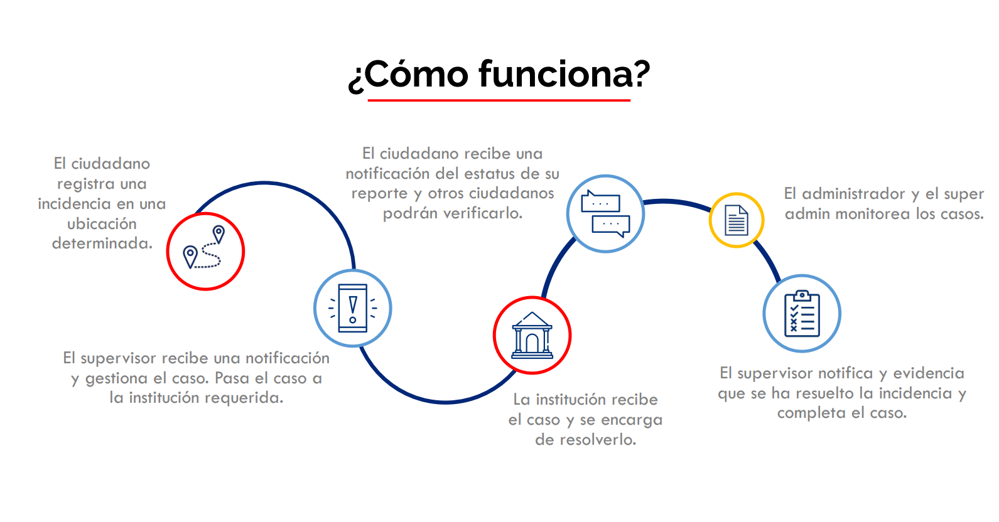
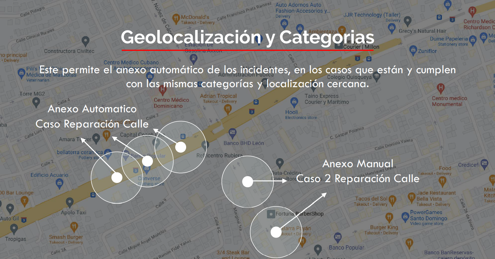

## ¿Que es?

Inspector Ciudadano es una aplicación  móvil que permite al usuario hacer  reportes de incidencias del día a día  que afectan su entorno y la sociedad  según su localización.

## Atributos

|                      Proactiva                      |                 Participativa                  |                Accesible                | Flexible |
|    :---:     |     :---:      |     :---:     |     :---:     |
| _Ciudadanos y Supervisores podrán realizar reportes_ | _Todos los ciudadanos pueden realizar reportes_ | _Fácil y rápido acceso a la información_ |_El usuario puede reportar incidencias de distintas zonas_|

## Tipos de reportes

-   SERVICIOS
    -   Agua
    -   Luz
    -   Telecomunicaciones
    -   Salud
    -   Educación
    -   Deportes
-   INFRAESTRUCTURAS
    -   Construcción
    -   Comunicación vial
    -   Reparación
    -   Espacios públicos
-   SEGURIDAD
    -   Accidentes
    -   Asaltos
    -   Robos
    -   Desorden publico
    -   Ausencia de autoridades
-   MEDIOAMBIENTE
    -   Desastres naturales
    -   Animales
    -   Arboles

## Usuarios y Permisos

|                      CIUDADANOS                      |                 SUPERVISORES                 |                ADMINISTRADORES                | SUPER ADMIN |
|    :---:     |     :---:      |     :---:     |     :---:     |
| _Reporta incidencias_ |   _Valida reportes_   | _Monitorea los reportes_ |_Dashboard casos por zona_|
| _Visualiza estatus de reportes_ | _Reporta incidencias_ |    _Valida los casos_    |_Monitorea desempeño de dirigentes y encargados_|
| _Verifica otros reportes_ |   _Gestiona casos_    |            -             |-|
| - |  _Actualiza estatus_  |            -             |-|

## ¿Cómo funciona?

-   [Interfaz Grafica - Acceso del Ciudadano](citizen-access.md)

-   [Interfaz Grafica - Acceso del Supervisor](supervisor-access.md)

## Beneficios

-   Validación de prioridades según los reportes.
-   Data en tiempo real de estatus de reportes.
-    Base de datos de incidencias por tipo y zona.
-   Monitoreo de seguimiento del trabajo entre supervisores y entidades involucradas.
-   Acceso desde todo el territorio nacional.
-   Participación activa de la ciudadanía.

## Necesidades

-   Definición de tipos de usuario y niveles de permiso.
-   Pautar un taller con una muestra de los supervisores para poder levantar su flujo de trabajo.
-   Afinar Tipos de incidencia(Categorías, Sub-Categorías, etc..).
-   Validar flujos, etapas y sistemas de permisos actuales contra la visión del cliente.
-   Levantamiento de flujo de trabajo entre Inspector - Institución.
-   Pautas de tiempo para resolver los incidentes reportados.
-   Levantamiento de Diseño para identidad y branding.