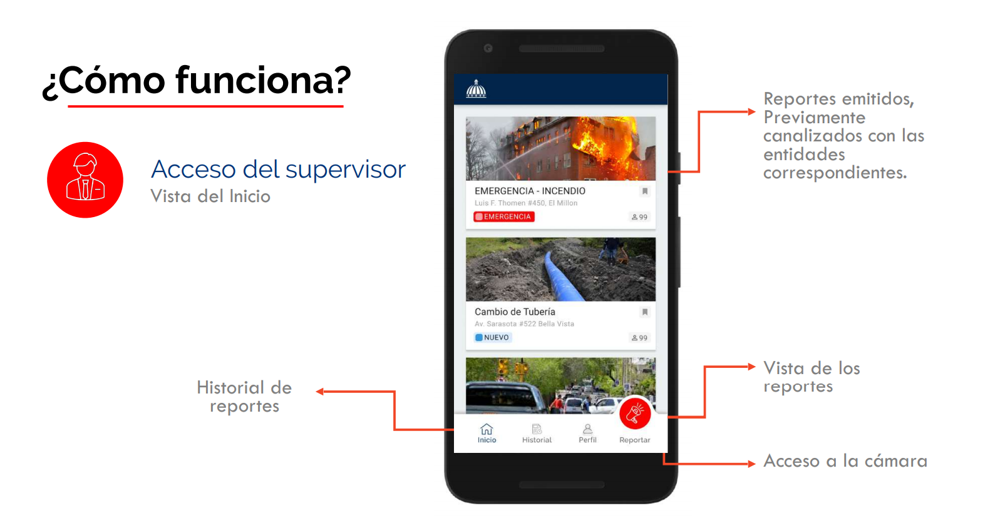
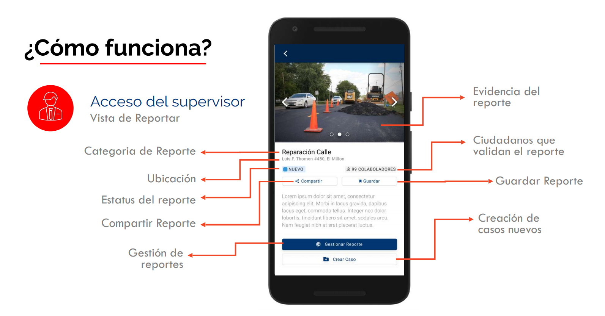
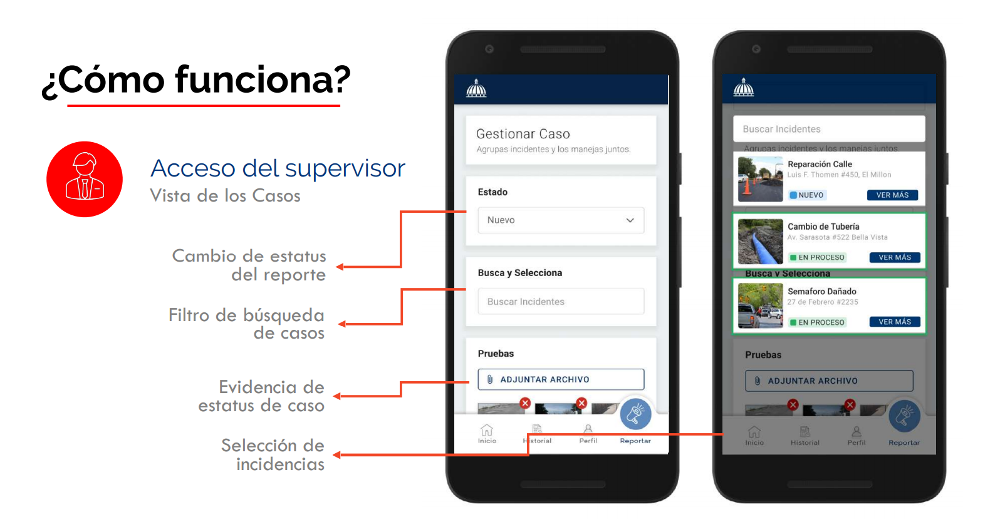
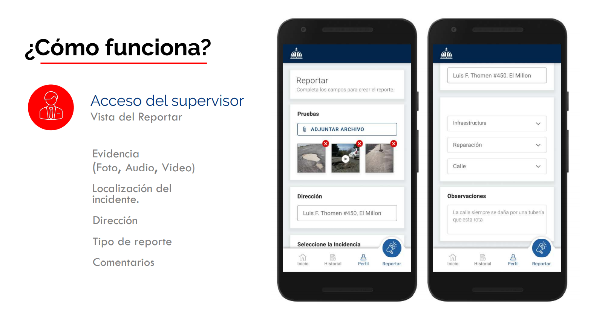

## El rol del supervisor

El supervisor es el intermediario entre el ciudadano y las entidades, su rol principal es  gestionar los reportes desde la recepción hasta la solución al problema.

-   _Recibe los reportes realizados por los ciudadanos_
-   _Analiza el reporte (o varios vinculados) y crea el caso.  *Notifica en la app el inicio del caso*._
-   _Gestiona el caso con las instituciones correspondientes._
-   _Una vez completado el caso, evidencia y notifica en la app._

